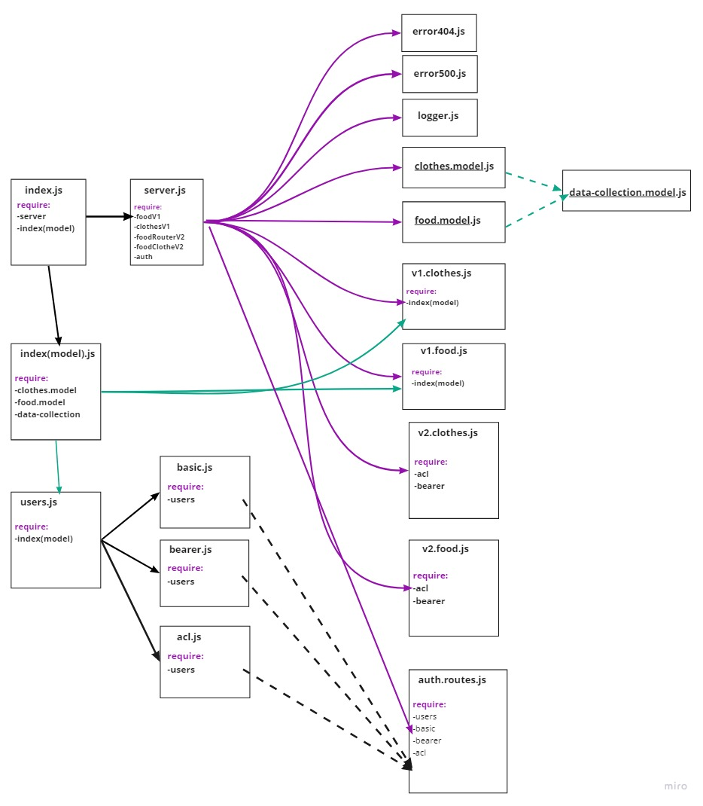

# *Authentication-API *
---

### **Summary work of the application**
Build Server app with some Authentication, Bearer Authorization and ACL To check if the user had the authorized to give him the access, And add a ACL to create a role for each user and give him access regarding the role.

### **UML Diagram**

---

### **Heroku App**
🔗[Heroku App](https://acl-omarsawalmeh.herokuapp.com/)
### **GitHub Action**
🔗[GitHub Actions](https://github.com/OmarSawalmeh/auth-api/actions)
### **Pull Requests**
🔗[pull requests](https://github.com/OmarSawalmeh/auth-api/pulls)